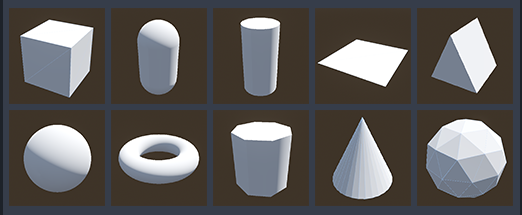

# Godot Quick Primitives

## About
Quick primitives is a simple plugin for Godot that allows you to quickly create 3D primitives in your projects using a shortcut bar.

## How to install
Copy "quick_primitives" folder inside the "addons" folder of your Godot project and activate the plugin in the project settings.

## How to use it
Just click on the primitive icon to instantiate it in the current scene.

